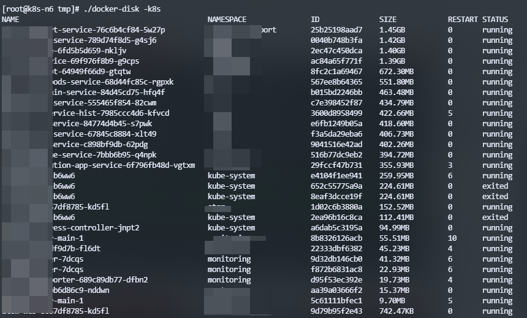

这是一个便携的Docker运维小工具，方便运维或开发人员查找容器的磁盘占用，如果机器为kubernetes node节点，则可以通过k8s参数对名称进行解析,解析后的名称将更友好的显示kubernetes pod信息

k8s容器临时存储长时间情况下会导致容器磁盘占用量增大，可以通过`ephemeral-storage`参数限制k8s容器磁盘,但是这种会导致使用过程中容器被驱逐，对开发人员不太友好，更好的方式是采用NFS或其他磁盘存储

运维人员排查容器磁盘占用可使用`docker system df -v`查看容器和镜像磁盘占用，但是过滤筛选比较麻烦，通过此工具，可以快速过滤筛选磁盘信息，结合kubectl可以快速删除占用量大的POD容器


#### 编译安装
```shell
go build 
```
#### 服务器快速安装
```shell
curl https://ddn-cloud.oss-cn-beijing.aliyuncs.com/github/docker-disk/docker-disk-linux-amd64 -o /usr/bin/docker-disk
chmod +x /usr/bin/docker-disk
```
#### 使用命令
```shell
# 显示所有容器磁盘占用
./docker-disk

# 使用k8s名称解析
./docker-disk -k8s

# 过滤占用大于1g的容器
./docker-disk -size 1g

# 不显示k8s pause容器
./docker-disk -k8s -nopause
```

#### 配合kubectl删除容器
```shell
# 显示删除命令
./docker-disk -k8s -size 1g -delete-commond

# 调用kubectl删除
./docker-disk -k8s -size 1g -delete-commond |xargs -I {} bash -c "{}"
```

#### 版本异常解决
> Error response from daemon: client version 1.39 is too new. Maximum supported API version is 1.35

**解决:**
```shell
# 指定API版本 
./docker-disk -withversion 1.35
./docker-disk -withversion `docker version|grep "API version"|awk '{print $3}'|head -n 1`
```

#### 截图展示

